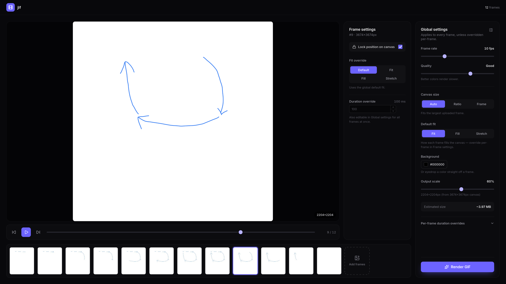

# jif


[](https://jifstudio.vercel.app)

A client-side GIF maker. Drop in a batch of images, reorder them into a
sequence, preview the loop, tune fps/quality/size, and export a GIF - all in
the browser. No backend, no uploads.


Built with React + Vite + Tailwind, encoding via [gif.js](https://github.com/jnordberg/gif.js)
(runs in a Web Worker so the UI stays responsive during export).

## Features

- Bulk upload — drag in a whole batch of images at once
- Reorder, duplicate, and trim the frame sequence
- Live preview before export
- Per-frame duration overrides, plus global fps/quality/canvas settings
- Adjustable output scale and quality, with an estimated file size
- Instant client-side export, no waiting on a server



## Develop

```
pnpm install
pnpm dev
```

## Build

```
pnpm build
pnpm preview   # sanity-check the production build locally
```

`pnpm install` copies gif.js's worker script into `public/gif.worker.js` via a
`postinstall` hook (`scripts/copy-gif-worker.mjs`) so it's served as a static
asset in both dev and the production build. It's also committed to the repo,
so a fresh `pnpm build` works even without a prior `pnpm install`.

## Deployment

Deployed on Vercel, connected to this repo. Pushes to `main` deploy to
production automatically, and PRs/branches get preview deployments.

Live at [jifstudio.vercel.app](https://jifstudio.vercel.app).
